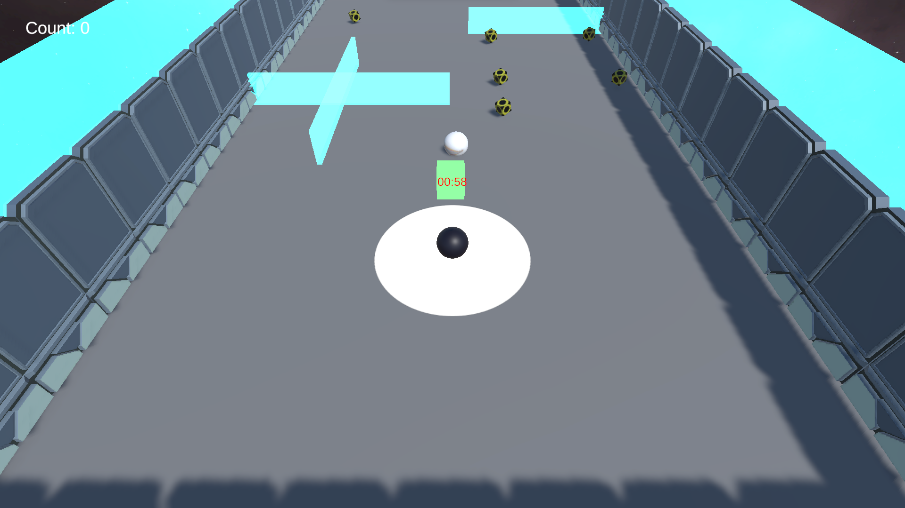

# README - HumanVsAgent

## Descrição do Jogo

HumanVsAgent é um jogo desenvolvido no Unity, baseado no tutorial padrão Roll A Ball, porém com uma temática espacial. Neste jogo, o jogador assume o papel de um explorador espacial em uma missão para coletar todos os "PickUps" espalhados pela cena antes que o tempo limite de 1 minuto se esgote. No entanto, o desafio é intensificado pelo fato de que um agente treinado com o toolkit ML-Agents da Unity está competindo contra você. Além disso, se a rede neural no agente alcançar um alvo específico antes de você coletar todos os pickups, você também perderá o jogo.

HumanVsAgent oferece uma experiência emocionante e desafiadora, onde o jogador precisa demonstrar habilidades de navegação ágeis e estratégias inteligentes para superar o adversário virtual e completar a missão com sucesso.

## Desenvolvimento

HumanVsAgent foi desenvolvido utilizando o Unity Engine, uma poderosa ferramenta de desenvolvimento de jogos. A implementação do agente adversário foi realizada com o uso do toolkit ML-Agents da Unity, permitindo a criação de comportamentos autônomos baseados em inteligência artificial.

## Como Jogar

1. **Objetivo**: Coletar todos os "PickUps" na cena antes que o tempo limite de 1 minuto expire, enquanto evita que o agente adversário alcance um alvo específico antes de você.

2. **Controles**:
   - Setas direcionais: Movimentação do jogador para frente, trás, esquerda e direita.
   - Barra de Espaço: Salto.

3. **Instruções**:
   - Use as setas direcionais para navegar pelo ambiente espacial e coletar os pickups espalhados pela cena.
   - Pressione a barra de espaço para pular sobre obstáculos ou alcançar pickups em locais elevados.
   - Evite colidir com obstáculos e o agente adversário.
   - Fique atento ao tempo restante e colete todos os pickups antes que o cronômetro chegue a zero.
   - Se o agente adversário alcançar o alvo antes de você coletar todos os pickups, você perderá o jogo.

## Redes Neurais

Aqui no repositório, na pasta ``results`` constam os logs do treinamento dos agentes e as redes neurais treinadas. Muitas delas foram evolução de processos de treinamento, e por isso, não estão necessariamente na última geração. Além disso, o arquivo de configuração do treinamento é o ``config_enemy.yaml``. Lá podemos alterar hiper-parâmetros e a arquitetura da rede neural. 

## Melhorias Futuras

Por conta do tempo limitado, não foi possível treinar uma agente que oferecesse um desafio significativo ao jogador. No entanto, a ideia é treinar um agente mais inteligente e desafiador, que possa competir de forma mais eficaz contra o jogador. Além disso, outras melhorias planejadas incluem:

- **Novos Níveis**: Adição de novos níveis com diferentes layouts e desafios.
- **Novos Objetos**: Adição de novos objetos e elementos interativos para aumentar a complexidade e a diversão.

## Citações de Assets

- **Unity Engine**: Plataforma de desenvolvimento de jogos utilizada para criar o jogo.

- **ML-Agents Toolkit**: Utilizado para implementar o agente adversário com inteligência artificial.

- **Assets de HumanVsAgent**: Todos os assets utilizados no jogo foram criados internamente ou obtidos legalmente de fontes gratuitas, seguindo as políticas de licenciamento e direitos autorais.

- **Assets de Som** :  https://www.portaldosmemes.com.br/

- **Assets Sci-Fi** : https://assetstore.unity.com/packages/3d/environments/sci-fi/sci-fi-styled-modular-pack-82913